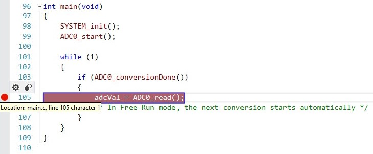
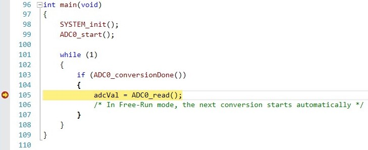
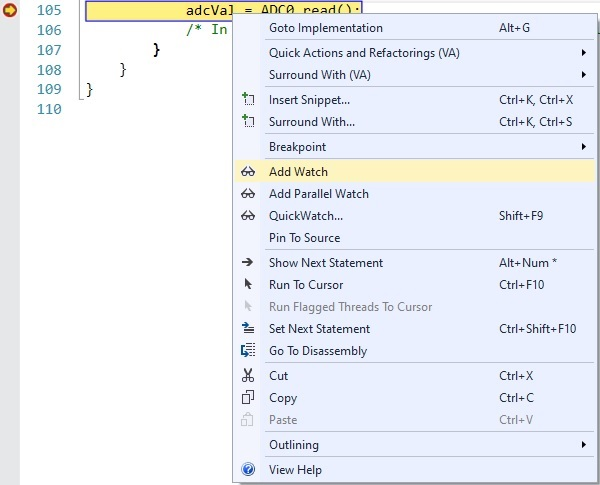
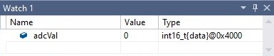
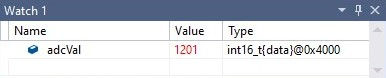

# Differential Conversion Showcase

The AVR128DA48 features one 12-bit differential ADC. In this demo, one POT click board™ and one POT 2 Click board™ will be attached to the mikroBus socket #1 and socket #2 of a Curiosity Nano Base board and the analog values provided by the two potentiometers will be read using AIN3 and AIN4 channels.

## Related Documentation
More details and code examples on the AVR128DA48 can be found at the following links:
- [AVR128DA48 Product Page](https://www.microchip.com/wwwproducts/en/AVR128DA28)
- [AVR128DA48 Code Examples on GitHub](https://github.com/microchip-pic-avr-examples?q=avr128da48)
- [AVR128DA48 Project Examples in START](https://start.atmel.com/#examples/AVR128DA48CuriosityNano)

## Software Used
- Microchip Studio 7.0.2397 or newer [(Microchip Studio for AVR® and SAM Devices)](https://www.microchip.com/en-us/development-tools-tools-and-software/microchip-studio-for-avr-and-sam-devices)
- AVR-Dx 1.0.18 or newer Device Pack

## Hardware Used
- AVR128DA48 Curiosity Nano [(DM164151)](https://www.microchip.com/Developmenttools/ProductDetails/DM164151)
- Curiosity Nano Base for Click boards™ [(AC164162)](https://www.microchip.com/Developmenttools/ProductDetails/AC164162)
- POT Click board™ [(MIKROE-3402)](https://www.mikroe.com/pot-click)
- POT 2 Click board™ [(MIKROE-3325)](https://www.mikroe.com/pot-2-click)

## Setup
The AVR128DA48 Curiosity Nano Development Board is used as test platform, along with the Curiosity Nano Base for Click boards™ and the POT Click board™.
 

The following configurations must be made for this project:

- ADC0 - Configured in Free Run Mode with Differential Mode activated
- VREF - Reference voltage for ADC0 set to 2.048V

|Pin           | Configuration      |
| :----------: | :----------------: |
|PD3           | Analog Input       |
|PD4           | Analog Input       |

## Operation
To visualize the read ADC value, follow the instructions below.
1. Open the *AVR_DA_ADC_Differential_example.atsln* project solution in Microchip Studio

2. In `main` function from main.c file, add a breakpoint on line 101
     

3. Run the project in Debug Mode (shortcut: F5)
     
     

4. Right click on `adcVal` variable and select Add Watch
     

    In the watch window, `adcVal` was added and its value is 0 because up to this point, it hasn't been changed.
     

5. Continue debugging (shortcut: F5) to read the value from ADC
     

6. In the watch window, `adcVal` value should be the one returned by ADC read.
     

## Summary
The demo provides an example of differential ADC application using the 12-bit ADC peripheral on the new AVR-DA family.
